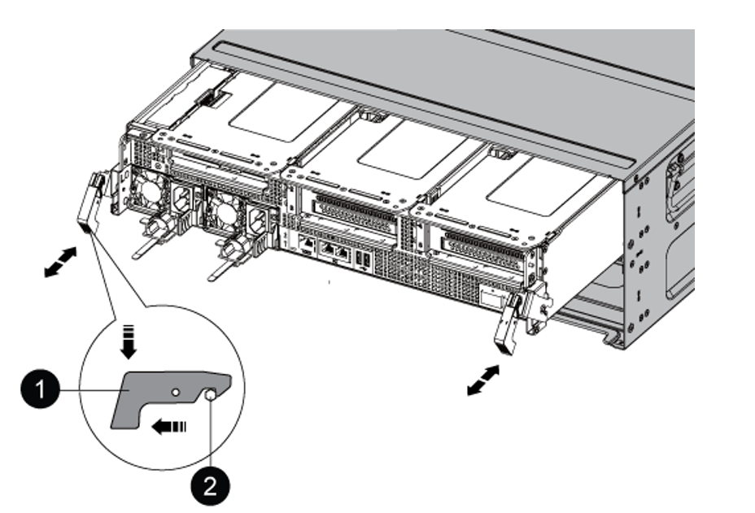

= Remplacer les modules de contrôleur AFF A800
:hardbreaks:
:allow-uri-read: 
:nofooter: 
:icons: font
:linkattrs: 
:imagesdir: ./media/

[role="lead"]
À ce stade, le nœud 1 est en panne et toutes les données sont servies par le nœud 2. Les nœuds 1 et 2 se trouvant dans le même châssis et alimentés par le même ensemble d'alimentations, NE mettez PAS le châssis hors tension. Veillez à ne retirer que le module de contrôleur du nœud 1. En général, le nœud 1 est le contrôleur A, situé sur le côté gauche du châssis, lorsque vous regardez les contrôleurs depuis l'arrière du système. L'étiquette du contrôleur se trouve sur le châssis, directement au-dessus du module de contrôleur.

.Avant de commencer
Si vous n'êtes pas déjà mis à la terre, mettez-vous à la terre correctement.

== Préparer le retrait du module de contrôleur AFF A800

.Étapes
. À l'avant du châssis, enfoncez fermement chaque disque jusqu'à ce que vous sentiez un arrêt positif. Cela permet de s'assurer que les disques sont fermement installés contre le fond de panier central du châssis.
+

. Aller à l'arrière du châssis.

== Déposer le module de contrôleur AFF A800

Retirez le périphérique de gestion des câbles du module contrôleur AFF A800 et déplacez légèrement le contrôleur hors du châssis.

.Étapes
. Débranchez les alimentations du module de contrôleur du nœud 1 de la source.
. Libérez les dispositifs de retenue du câble d'alimentation, puis débranchez les câbles des blocs d'alimentation.
. Desserrez le crochet et la bride de boucle reliant les câbles au dispositif de gestion des câbles, puis débranchez les câbles du système et les modules SFP et QSFP (si nécessaire) du module de contrôleur, en gardant une trace de l'emplacement de connexion des câbles.
+
Laissez les câbles dans le périphérique de gestion des câbles de sorte que lorsque vous réinstallez le périphérique de gestion des câbles, les câbles sont organisés.

. Retirez le périphérique de gestion des câbles du module de contrôleur et mettez-le de côté.
. Appuyez sur les deux loquets de verrouillage, puis faites pivoter les deux loquets vers le bas en même temps.
+
Le module de contrôleur se déplace légèrement hors du châssis.

+

+
[cols="20,80"]
|===

 a| 

| Loquet de verrouillage 

 a| 
image::../media/black_circle_two.png[Numéro deux]
| Goupille de blocage 
|===

== Installez le module de contrôleur AFF A90 ou AFF A70

Installez, câblez et connectez le module de contrôleur AFF A90 ou AFF A70 au niveau du nœud 1.

.Étapes
. Alignez l'extrémité du module de contrôleur avec l'ouverture du châssis, puis poussez doucement le module de contrôleur à mi-course dans le système.
+

NOTE: N'insérez pas complètement le module de contrôleur dans le châssis avant d'en avoir été invité dans la procédure.

+
image::../media/drw_A70-90_PCM_remove_replace_IEOPS-1365.PNG[Installer un AFF A90 ou un AFF A70]

. Reliez les ports de gestion et de console au module de contrôleur node1.
+

NOTE: Comme le châssis est déjà sous tension, le nœud 1 démarre l'initialisation du BIOS, suivie d'UNE initialisation AUTOMATIQUE dès que vous insérez le nouveau module de contrôleur. Pour éviter ce DÉMARRAGE AUTOMATIQUE, NetApp recommande de connecter les câbles série et console avant d'insérer le module de contrôleur.

. Avec la poignée de came en position ouverte, poussez fermement le module de contrôleur jusqu'à ce qu'il rencontre le fond de panier central et qu'il soit bien en place. Le loquet de verrouillage s'élève lorsque le module de contrôleur est bien en place. Fermer la poignée de came en position verrouillée.
+

NOTE: Pour éviter d'endommager les connecteurs, n'utilisez pas de force excessive lorsque vous faites glisser le module de contrôleur dans le châssis.

. Connectez la console série dès que le module est assis et soyez prêt à interrompre AUTOBOOT du nœud 1.
. Après l'interruption DE L'AUTOBOOT, le nœud 1 s'arrête à l'invite DU CHARGEUR.
+
Si vous n'interrompez pas LE démarrage AUTOMATIQUE à temps et que le démarrage du nœud 1 commence, attendez l'invite et appuyez sur Ctrl-C pour accéder au menu de démarrage. Une fois que le nœud s'arrête au menu de démarrage, utilisez l'option `8` pour redémarrer le nœud et interrompre le DÉMARRAGE AUTOMATIQUE pendant le redémarrage.

. À l'invite DU CHARGEUR> du nœud 1, définissez les variables d'environnement par défaut :
+
`set-defaults`

. Enregistrez les paramètres des variables d'environnement par défaut :
+
`saveenv`

