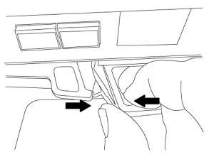

= Remplacez les modules système du nœud 1
:hardbreaks:
:allow-uri-read: 
:nofooter: 
:icons: font
:linkattrs: 
:imagesdir: ./media/

[role="lead"]
Remplacez les modules système du nœud 1 pour votre configuration de mise à niveau :

* <<replace_modules,Remplacez le module de contrôleur AFF A220, AFF A200, AFF C190, FAS2620 ou FAS2720>>
+

NOTE: Vous pouvez également utiliser cette procédure pour remplacer un AFF A220 configuré en tant que ASA.

* <<Remplacez le contrôleur AFF A700 ou FAS9000 et les modules NVRAM>>
+

NOTE: Vous pouvez également utiliser cette procédure pour remplacer un système AFF A700 configuré en tant que ASA.

== Remplacez le module de contrôleur AFF A220, AFF A200, AFF C190, FAS2620 ou FAS2720

À ce stade, le nœud 1 est en panne et toutes les données sont servies par le nœud 2. Les nœuds 1 et 2 se trouvant dans le même châssis et alimentés par le même ensemble d'alimentations, NE mettez PAS le châssis hors tension. Veillez à ne retirer que le module de contrôleur du nœud 1. En général, le nœud 1 est le contrôleur A, situé sur le côté gauche du châssis, lorsque vous regardez les contrôleurs depuis l'arrière du système. L'étiquette du contrôleur se trouve sur le châssis, directement au-dessus du module de contrôleur.

.Avant de commencer
Si vous n'êtes pas déjà mis à la terre, mettez-vous à la terre correctement.

=== Retirez le module de contrôleur AFF A220, AFF A200, AFF C190, FAS2620 ou FAS2720

Pour accéder aux composants à l'intérieur du contrôleur, vous devez d'abord retirer le module de contrôleur du système, puis retirer le capot du module de contrôleur.

.Étapes
. Desserrez le crochet et la bride de boucle qui relient les câbles au périphérique de gestion des câbles, puis débranchez les câbles système et les SFP (si nécessaire) du module de contrôleur, en maintenant une trace de l'emplacement où les câbles ont été connectés.
+
Laissez les câbles dans le périphérique de gestion des câbles de sorte que lorsque vous réinstallez le périphérique de gestion des câbles, les câbles sont organisés.

. Retirez et mettez de côté les dispositifs de gestion des câbles des côtés gauche et droit du module de contrôleur.
+
image::../media/drw_25xx_cable_management_arm.png[Retrait du ARM de gestion des câbles]

. Appuyez sur le loquet de la poignée de came jusqu'à ce qu'il se libère, ouvrez complètement la poignée de came pour libérer le module de contrôleur du fond de panier central, puis, à l'aide de deux mains, retirez le module de contrôleur du châssis.
+

. Retournez le module de contrôleur et placez-le sur une surface plane et stable.

=== Installez le module de contrôleur ASA A150, AFF A150 ou FAS2820

Utilisez la procédure suivante pour installer le module de contrôleur ASA A150, AFF A150 ou FAS2820 dans le nœud 1.

.Étapes
. Alignez l'extrémité du module de contrôleur avec l'ouverture du châssis, puis poussez doucement le module de contrôleur à mi-course dans le système.
+

NOTE: N'insérez pas complètement le module de contrôleur dans le châssis avant d'en avoir été invité dans la procédure.

. Reliez les ports de gestion et de console au module de contrôleur node1.
+

NOTE: Comme le châssis est déjà sous tension, le nœud 1 démarre l'initialisation du BIOS, suivie de l'AUTOBOOT, dès qu'il est entièrement installé. Pour interrompre le démarrage du nœud 1, il est recommandé de connecter les câbles de console série et de gestion au module de contrôleur node1 avant d'insérer complètement le module de contrôleur dans le slot.

. Avec la poignée de came en position ouverte, poussez fermement le module de contrôleur jusqu'à ce qu'il rencontre le fond de panier central et qu'il soit bien en place. Le loquet de verrouillage s'élève lorsque le module de contrôleur est bien en place. Fermer la poignée de came en position verrouillée.
+

NOTE: Pour éviter d'endommager les connecteurs, n'utilisez pas de force excessive lorsque vous faites glisser le module de contrôleur dans le châssis.

. Connectez la console série dès que le module est assis et soyez prêt à interrompre AUTOBOOT du nœud 1.
. Après l'interruption DE L'AUTOBOOT, le nœud 1 s'arrête à l'invite DU CHARGEUR. Si vous n'interrompez pas AUTOBOOT à temps et que le nœud1 commence à démarrer, attendez l'invite et appuyez sur *Ctrl-C* pour accéder au menu de démarrage. Une fois que le nœud s'arrête au menu de démarrage, utilisez l'option 8 pour redémarrer le nœud et interrompre le DÉMARRAGE AUTOMATIQUE pendant le redémarrage.
. À l'invite DU CHARGEUR> du nœud 1, définissez les variables d'environnement par défaut :
+
`set-defaults`

. Enregistrez les paramètres des variables d'environnement par défaut :
+
`saveenv`

== Remplacez le contrôleur AFF A700 ou FAS9000 et les modules NVRAM

À ce stade, le nœud 1 est en panne et toutes les données sont servies par le nœud 2. Les nœuds 1 et 2 se trouvant dans le même châssis et alimentés par le même ensemble d'alimentations, NE mettez PAS le châssis hors tension. Vous devez faire attention de ne retirer que le module de contrôleur node1 et le module NVRAM node1. En général, le nœud 1 est le contrôleur A, situé sur le côté gauche du châssis, lorsque vous regardez les contrôleurs depuis l'arrière du système. L'étiquette du contrôleur se trouve sur le châssis, directement au-dessus du module de contrôleur.

.Avant de commencer
Si vous n'êtes pas déjà mis à la terre, mettez-vous à la terre correctement.

=== Retirez le module de contrôleur AFF A700 ou FAS9000

Suivre la procédure suivante pour retirer le module de contrôleur AFF A700 ou FAS9000.

.Étapes
. Débranchez le câble de la console, le cas échéant, et le câble de gestion du module de contrôleur du nœud 1 avant de retirer le module de contrôleur du nœud 1.
+

WARNING: Lorsque vous travaillez sur le nœud 1, vous ne retirez que les câbles de la console et e0M du nœud 1. Au cours de ce processus, vous ne devez pas supprimer ni modifier d'autres câbles ou connexions sur le nœud1 ou le nœud2.

. Déverrouiller et retirer le module de contrôleur A du châssis.
+
.. Faites glisser le bouton orange sur la poignée de came vers le bas jusqu'à ce qu'il se déverrouille.
+
image::../media/drw_9500_remove_PCM.png[Déposer le module de contrôleur]

+
[cols="20,80"]
|===

 a| 
image::../media/black_circle_one.png[Numéro un]
| Bouton de déverrouillage de la poignée de came 

 a| 
image::../media/black_circle_two.png[Numéro deux]
| Poignée de came 
|===
.. Faites pivoter la poignée de came de façon à ce qu'elle désengage complètement le module de contrôleur du châssis, puis faites glisser le module de contrôleur hors du châssis.
+
Assurez-vous de prendre en charge la partie inférieure du module de contrôleur lorsque vous le faites glisser hors du châssis.

=== Retirez le module NVRAM AFF A700 ou FAS9000

Utilisez la procédure suivante pour retirer le module NVRAM AFF A700 ou FAS9000.

NOTE: Le module NVRAM AFF A700 ou FAS9000 est situé dans l'emplacement 6 et double la hauteur des autres modules du système.

.Étapes
. Déverrouiller et retirer le module NVRAM du logement 6 du nœud1.
+
.. Appuyer sur le bouton à came numéroté et numéroté.
+
Le bouton de came s'éloigne du châssis.

.. Faites pivoter le loquet de came vers le bas jusqu'à ce qu'il soit en position horizontale.
+
Le module NVRAM se désengage du châssis et se déplace en quelques pouces.

.. Retirez le module NVRAM du châssis en tirant sur les languettes de traction situées sur les côtés de la face du module.
+
image::../media/drw_a900_move-remove_NVRAM_module.png[Retirez le module NVRAM]

+
[cols="20,80"]
|===

 a| 
image::../media/black_circle_one.png[Numéro un]
| Loquet de came d'E/S numéroté et numéroté 

 a| 
image::../media/black_circle_two.png[Numéro deux]
| Loquet d'E/S complètement déverrouillé 
|===

=== Installez les modules de contrôleur et la mémoire NVRAM du système ASA A900, AFF A900 ou FAS9500

Installez les modules de contrôleur et NVRAM du système ASA A900, AFF A900 ou FAS9500 que vous avez reçus pour la mise à niveau sur le nœud 1.

Lors de l'installation, vous devez prendre note des points suivants :

* Déplacez tous les modules de remplissage vides dans les emplacements 6-1 et 6-2 de l'ancien module NVRAM vers le nouveau module NVRAM.
* NE déplacez PAS le périphérique coredump du module NVRAM AFF A700 vers le module NVRAM ASA A900 ou AFF A900.
* Déplacez tous les modules de cache Flash installés dans le module NVRAM FAS9000 vers le module NVRAM FAS9500.

.Avant de commencer
Si vous n'êtes pas déjà mis à la terre, mettez-vous à la terre correctement.

==== Installez le module NVRAM ASA A900, AFF A900 ou FAS9500

Utilisez la procédure suivante pour installer le module NVRAM ASA A900, AFF A900 ou FAS9500 dans le logement 6 du nœud 1.

.Étapes
. Alignez le module NVRAM sur les bords de l'ouverture du châssis dans le logement 6.
. Faites glisser doucement le module NVRAM dans le slot jusqu'à ce que le loquet de came d'E/S numéroté et numéroté commence à s'engager avec la broche de came d'E/S, puis poussez le loquet de came d'E/S jusqu'à ce que le module NVRAM soit en place.
+
image::../media/drw_a900_move-remove_NVRAM_module.png[Installez le module NVRAM]

+
[cols="20,80"]
|===

 a| 
image::../media/black_circle_one.png[Numéro un]
| Loquet de came d'E/S numéroté et numéroté 

 a| 
image::../media/black_circle_two.png[Numéro deux]
| Loquet d'E/S complètement déverrouillé 
|===

==== Installez le module de contrôleur ASA A900, AFF A900 ou FAS9500 sur le nœud 1.

Utilisez la procédure suivante pour installer le module de contrôleur ASA A900, AFA A900 ou FAS9500 dans le nœud 1.

.Étapes
. Alignez l'extrémité du module de contrôleur avec l'ouverture A du châssis, puis poussez doucement le module de contrôleur à mi-course dans le système.
+

NOTE: N'insérez pas complètement le module de contrôleur dans le châssis avant d'en avoir été invité dans la procédure.

. Reliez les ports de gestion et de console au module de contrôleur node1.
+

NOTE: Comme le châssis est déjà sous tension, le nœud 1 démarre l'initialisation du BIOS, suivie de l'AUTOBOOT, dès qu'il est entièrement installé. Pour interrompre le démarrage du nœud 1, il est recommandé de connecter les câbles de console série et de gestion au module de contrôleur node1 avant d'insérer complètement le module de contrôleur dans le slot.

. Poussez fermement le module de contrôleur dans le châssis jusqu'à ce qu'il rencontre le fond de panier central et qu'il soit bien en place.
+
Le loquet de verrouillage s'élève lorsque le module de contrôleur est bien en place.

+

WARNING: Pour éviter d'endommager les connecteurs, n'utilisez pas de force excessive lorsque vous faites glisser le module de contrôleur dans le châssis.

+
image::../media/drw_9500_remove_PCM.png[Installez le module de contrôleur]

+
[cols="20,80"]
|===

 a| 
image::../media/black_circle_one.png[Numéro un]
| Loquet de verrouillage de la poignée de came 

 a| 
image::../media/black_circle_two.png[Numéro deux]
| Poignée de came en position déverrouillée 
|===
. Connectez la console série dès que le module est assis et soyez prêt à interrompre AUTOBOOT du nœud 1.
. Après l'interruption DE L'AUTOBOOT, le nœud 1 s'arrête à l'invite DU CHARGEUR. Si vous n'interrompez pas AUTOBOOT à temps et que le nœud1 commence à démarrer, attendez l'invite et appuyez sur *Ctrl-C* pour accéder au menu de démarrage. Une fois le nœud arrêté dans le menu de démarrage, utilisez l'option `8` Pour redémarrer le nœud et interrompre L'AUTOBOOT pendant le redémarrage.
. À l'invite DU CHARGEUR> du nœud 1, définissez les variables d'environnement par défaut :
+
`set-defaults`

. Enregistrez les paramètres des variables d'environnement par défaut :
+
`saveenv`

