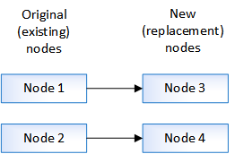

= Flux de travail
:allow-uri-read: 
:icons: font
:imagesdir: ../media/

[role="lead"]
Si vous mettez à niveau le matériel du contrôleur en déplaçant le stockage, vous préparez les nœuds d'origine et configurez les nouveaux nœuds. Certains modèles de plateforme prennent en charge le transfert du stockage interne vers les nouveaux nœuds. Vous réaffectez les disques et restaurez la configuration du volume racine aux nouveaux nœuds et configurez les ports réseau. La mise à niveau via le déplacement du stockage est une procédure perturbatrice.

[NOTE]
====
Afin de mettre à niveau le matériel du contrôleur en déplaçant le stockage, les nœuds d'origine sont appelés nœuds 1 et nœuds 2, et les nouveaux nœuds sont appelés nœuds 3 et nœuds 4. Au cours de la procédure décrite, le noeud 1 est remplacé par le noeud 3 et le noeud 2 est remplacé par le noeud 4.

Les termes node1, node2, node3 et node4 servent uniquement à faire la distinction entre les nœuds d'origine et les nouveaux nœuds. Lorsque vous suivez la procédure, vous devez les remplacer par les noms réels de vos nœuds d'origine et des nouveaux nœuds. Toutefois, en réalité, les noms des nœuds ne changent pas : le nœud 3 porte le nom node1 et le nœud 4 porte le nom node2 une fois le contrôleur mis à niveau.

====
.image:https://raw.githubusercontent.com/NetAppDocs/common/main/media/number-1.png["Une seule"]link:upgrade-prepare-when-moving-storage.html["Préparation à la mise à niveau lors du déplacement du stockage"]
[role="quick-margin-para"]
Avant de procéder à la mise à niveau en déplaçant le stockage, vous recueillez les informations de licence des nœuds d'origine, planifiez la configuration réseau, enregistrez les ID système et préparez les fichiers nécessaires à netboot.

.image:https://raw.githubusercontent.com/NetAppDocs/common/main/media/number-2.png["Deux"]link:upgrade-shutdown-remove-original-nodes.html["Arrêtez les nœuds d'origine"]
[role="quick-margin-para"]
Lors de l'arrêt et du retrait des nœuds d'origine, vous envoyez un message AutoSupport concernant la mise à niveau, détruisez les boîtes aux lettres, mettez les nœuds hors tension et retirez le châssis.

.image:https://raw.githubusercontent.com/NetAppDocs/common/main/media/number-3.png["Trois"]link:upgrade-remove-disk-ownership-new-nodes.html["Supprime la propriété des disques connectés aux nouveaux nœuds"]
[role="quick-margin-para"]
Si les nouveaux nœuds disposent de disques internes ou de tiroirs d'extension connectés au système, ces derniers peuvent interférer avec la mise à niveau du contrôleur.  Vous devez supprimer la propriété de tout nouveau disque livré avec le nœud 3/node4.

.image:https://raw.githubusercontent.com/NetAppDocs/common/main/media/number-4.png["Quatre"]link:upgrade-reset-default-configuration-node3-and-node4.html["Réinitialise la configuration par défaut sur les nouveaux nœuds"]
[role="quick-margin-para"]
Pour confirmer que les informations de configuration sur le support de démarrage n'interfèrent pas avec la mise à niveau du contrôleur, vous devez réinitialiser les configurations du nœud 3 et du nœud 4 sur les paramètres de configuration par défaut.

.image:https://raw.githubusercontent.com/NetAppDocs/common/main/media/number-5.png["Cinq"]link:upgrade-install-new-nodes.html["Installez les nouveaux nœuds"]
[role="quick-margin-para"]
Lorsque vous effectuez une mise à niveau en déplaçant le stockage, vous commencez par installer les nœuds node3 et nœud4, ainsi que par connecter l'alimentation, la console et les connexions réseau aux nouveaux nœuds.

.image:https://raw.githubusercontent.com/NetAppDocs/common/main/media/number-6.png["Six"]link:upgrade-set-up-new-nodes.html["Configurez les nouveaux nœuds"]
[role="quick-margin-para"]
Lors de la mise à niveau en déplaçant le stockage, vous mettez les nœuds 3 et 4 sous tension, démarrez l'image logicielle et configurez les nœuds. L'organisation des ports physiques entre les nœuds d'origine et les nouveaux peut être différente. Le mappage des ports entre les nœuds d'origine et de remplacement doit être réalisé afin d'identifier le schéma approprié des ports et des connexions.

.image:https://raw.githubusercontent.com/NetAppDocs/common/main/media/number-7.png["Sept"]link:upgrade-optional-move-internal-storage.html["Facultatif : déplacez le stockage interne ou convertissez le système en tiroir disque"]
[role="quick-margin-para"]
Si le nœud d'origine est un des modèles pris en charge, vous pouvez également déplacer ses disques SATA internes, SSD ou SAS vers un tiroir disque connecté aux nouveaux nœuds lors du processus de mise à niveau en déplaçant le stockage. Vous pouvez également convertir le système en tiroir disque et le connecter aux nouveaux nœuds.

.image:https://raw.githubusercontent.com/NetAppDocs/common/main/media/number-8.png["Huit"]link:upgrade-attach-shelves-reassign-disks.html["Ajout de tiroirs de stockage et réaffectation de la propriété des disques"]
[role="quick-margin-para"]
Vous réaffectez les disques appartenant au nœud 1 et au nœud 2 respectivement au nœud 3 et au nœud 4.

.image:https://raw.githubusercontent.com/NetAppDocs/common/main/media/number-9.png["Neuf"]link:upgrade-restore-root-volume-config.html["Restaurez la configuration du volume racine"]
[role="quick-margin-para"]
Vous restaurez les informations de configuration du volume racine sur les périphériques d'amorçage.

.image:https://raw.githubusercontent.com/NetAppDocs/common/main/media/number-10.png["Dix"]link:upgrade-complete.html["Terminez la mise à niveau"]
[role="quick-margin-para"]
Effectuez la mise à niveau dans ONTAP 9.8 ou version ultérieure ou ONTAP 9.7 ou version antérieure.

.Informations associées
* link:upgrade_aff_a250_to_aff_a400_ndu_upgrade_workflow.html["Mise à niveau de AFF A250 vers AFF A400 en convertissant en tiroir disque"] (procédure sans interruption).

