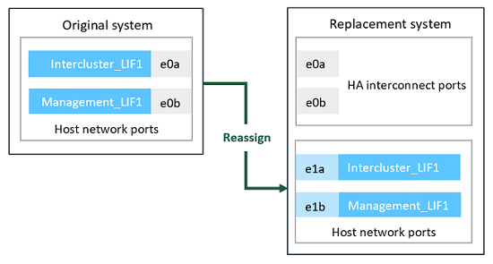

= Préparation à la mise à niveau lors du déplacement du stockage
:allow-uri-read: 
:icons: font
:imagesdir: ../media/

[role="lead"]
Avant de procéder à la mise à niveau vers le stockage, vous devez collecter les informations de licence à partir des nœuds d'origine, planifier la configuration réseau, enregistrer les ID système et préparer les fichiers nécessaires à netboot.

.Étapes
. Afficher et enregistrer les informations de licence à partir des nœuds d'origine, du node1 et du node2 :
+
`system license show`

. Si vous utilisez le cryptage du stockage sur la paire haute disponibilité des nœuds 1/NO2 et que les nouveaux nœuds disposent de disques compatibles avec le cryptage, veillez à ce que les disques des nœuds d'origine soient correctement saisis :
+
.. Affichage d'informations sur les disques à autochiffrement (SED)
+
`storage encryption disk show`

.. Si des disques sont associés à une clé non-MSID (ID non-fabricant), resaisissez-les à l'aide d'une clé MSID
+
`storage encryption disk modify`

. [[Prepare_Move_store_3]]Enregistrer les informations de configuration du port et de la LIF sur la paire HA node 1/node2 :
+
[cols="1,2"]
|===
| Pour afficher des informations sur... | Entrer... 

 a| 
Nombre de tiroirs, nombre de disques dans chaque tiroir, détails du stockage Flash, mémoire, NVRAM et cartes réseau
 a| 
`system node run -node _node_name_ sysconfig`

 a| 
LIF Cluster Network and node management
 a| 
`network interface show -role cluster,node-mgmt`

 a| 
Ports physiques
 a| 
`network port show -node _node_name_ -type physical`

 a| 
Groupes de basculement
 a| 
`network interface failover-groups show -vserver _vserver_name_`

Enregistrez les noms et les ports des groupes de basculement qui ne sont pas au niveau du cluster.

 a| 
Configuration VLAN
 a| 
`network port vlan show -node _node_name_`

Enregistrez le couplage de chaque port réseau et ID VLAN.

 a| 
Configuration du groupe d'interface
 a| 
`network port ifgrp show -node _node_name_ -instance`

Enregistrer les noms des groupes d'interface et des ports qui leur sont affectés.

 a| 
Les domaines de diffusion
 a| 
`network port broadcast-domain show`

 a| 
Informations IPspace
 a| 
`network ipspace show`

|===
. Obtenez des informations sur les ports de cluster par défaut, les ports de données et les ports de gestion de nœuds pour chaque nouveau nœud que vous mettez à niveau vers : https://hwu.netapp.com["NetApp Hardware Universe"^]
. [[assigner_lifs]]certains systèmes, par exemple FAS8700, AFF A400 ou FAS8300 Utilisez les ports e0a et e0b comme ports d'interconnexion haute disponibilité (HA). Si vous effectuez une mise à niveau depuis un système, comme un FAS8200 ou un AFF A300, vers un système qui utilise des ports e0a et e0b comme ports d'interconnexion haute disponibilité, Vous devez réallouer les LIFs de gestion et intercluster qui sont configurées sur ces ports du système d'origine sur d'autres ports du système de remplacement.
+

WARNING: Lorsque les ports e0a et e0b sont utilisés en tant que ports d'interconnexion haute disponibilité sur le système de remplacement, tous les LIF de gestion ou intercluster qui sont configurées sur ces ports peuvent provoquer une défaillance de mise à niveau en empêchant la configuration haute disponibilité de connecter les ports « e0a » et « e0b » pour démarrer le système de remplacement.

+
--
.. Vérifiez si votre système de remplacement utilise les ports e0a et e0b comme ports haute disponibilité : https://hwu.netapp.com["NetApp Hardware Universe"^]
.. Si nécessaire, identifiez les LIF de gestion ou intercluster configurées sur les ports « e0a » et « e0b » sur le système d'origine :
+
`network interface show -home-port _port_name_`

.. Si nécessaire, réallouer uniquement les LIF de gestion ou intercluster affectées aux ports réseau qui ne sont pas utilisés en tant que ports haute disponibilité sur le système de remplacement :
+
`network interface modify -vserver _vserver_name_ -lif _LIF_name_ -home-port _new_port_name_`

+
`network interface revert -vserver _vserver_name_ -lif _LIF_name_`

+
Dans l'exemple suivant, les LIF de gestion et intercluster sur les ports réseau « e0a » et « e0b » sont réaffectés aux ports réseau « e1a » et « e1b ». Vos nœuds peuvent utiliser différents ports réseau car ils varient selon le système.

+

--
. [[Prepare_Move_store_5]]Télécharger et préparer les fichiers utilisés pour effectuer netboot.
+
Une fois les nouveaux nœuds installés, vous pouvez avoir besoin de netboot pour vérifier que les nouveaux nœuds exécutent la même version d'ONTAP que les nœuds d'origine. Le terme netboot signifie que vous êtes en cours de démarrage à partir d'une image ONTAP stockée sur un serveur distant. Lorsque vous vous préparez à netboot, vous devez placer une copie de l'image de démarrage ONTAP 9 sur un serveur web auquel le système peut accéder.

+
.. Accédez au https://mysupport.netapp.com/site/["Site de support NetApp"^] pour télécharger les fichiers utilisés pour effectuer le démarrage sur le réseau du système.
.. Téléchargez le logiciel ONTAP approprié depuis la section de téléchargement des logiciels du site de support NetApp et stockez le `<ontap_version>_image.tgz` fichier dans un répertoire accessible sur le web.
.. Accédez au répertoire accessible sur le Web et vérifiez que les fichiers dont vous avez besoin sont disponibles.

+
[cols="1,2"]
|===
| Pour... | Alors... 

 a| 
*SYSTÈMES FAS2200, FAS2500, FAS3200, FAS6200, FAS/AFF8000*
 a| 
Extraire le contenu du `<ontap_version>_image.tgz` fichier dans le répertoire cible :
`tar -zxvf <ontap_version>_image.tgz`

*Remarque :* si vous extrayez le contenu sous Windows, utilisez 7-Zip ou WinRAR pour extraire l'image netboot.

Votre liste de répertoires doit contenir un dossier netboot avec un fichier du noyau :
`netboot/kernel`

 a| 
*Tous les autres systèmes*
 a| 
Votre liste de répertoires doit contenir le fichier suivant :

`<ontap_version>_image.tgz`

NOTE: Il n'est pas nécessaire d'extraire le contenu du `<ontap_version>_image.tgz` fichier.

|===

Vous allez utiliser les informations du répertoire pour link:upgrade-set-up-new-nodes.html["configurez les nouveaux nœuds"].
